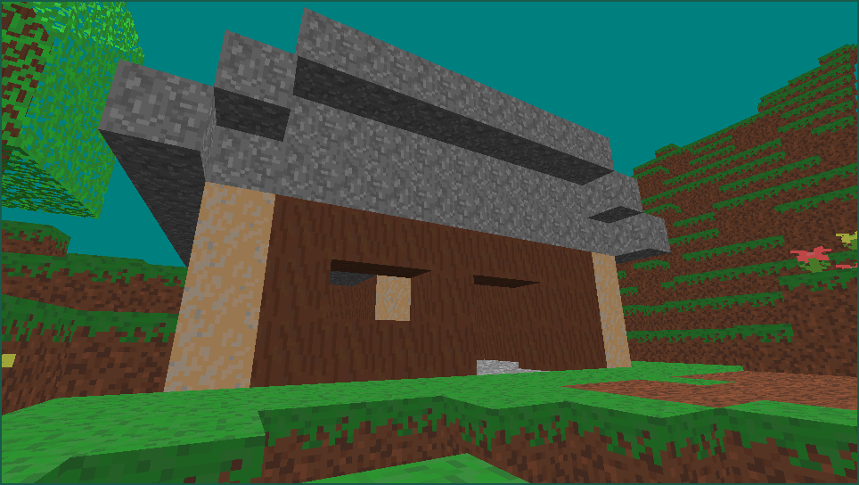
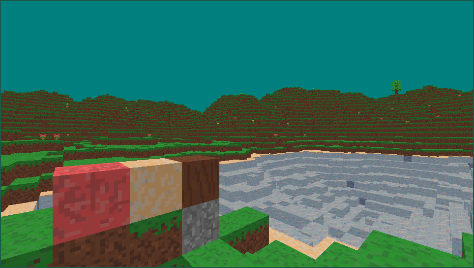
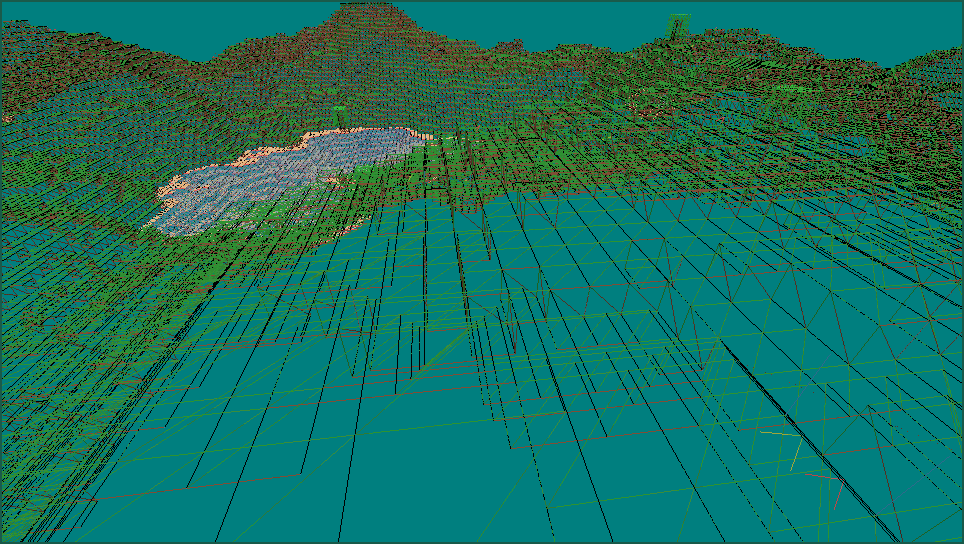

# cubesGame
* This is a terrain generator I made to learn the basics of OpenGL alongside using 2D perlin noise to generate a terrain of cubes while rendering only the visible parts of said cubes.
* The entire area is made up of 15x15 chunks.
* You can now break and place blocks.
* There's now basic AABB collision detection and physics running at constant 30fps independent of everything else. It still has many issues but it feels significantly better than how it used to be.
* I've done my best to make it use as little memory as possible.
## Controls
* WASD for movement.
* Space for jumping.
* Number row 1-6 to change the block you place.
* Left click to break blocks.
* Right click to place blocks.
* Q to quit.
## Examples



## Compiling and running on Linux
```
git clone --recurse-submodules https://github.com/m2neral/learnOpenGLCubes.git
cd learnOpenGLCubes
mkdir build
cmake -S . -B build
make -C build
./build/CUBESGAME
```
## Compiling and running on Windows
* Pick "Clone a Repository" on Visual Studio Community
* Enter "https://github.com/m2neral/learnOpenGLCubes.git"
* Edit CMakeLists.txt and uncomment the following line:
```
set(CMAKE_TRY_COMPILE_TARGET_TYPE "STATIC_LIBRARY")
```
* Choose "Build all" from the top menu
* Open the repo directory and find CUBESGAME.exe inside the out/ directory
* Launch CUBESGAME.exe
## Other
* The boilerplate code is almost entirely from https://learnopengl.com as that was the resource I was using to learn the basics.
* The perlin noise code is from https://youtu.be/kCIaHqb60Cw
* Finally managed to learn and add everything I wanted with this project. I will probably add a menu with basic settings next and play around with shaders and other visuals before being done.
